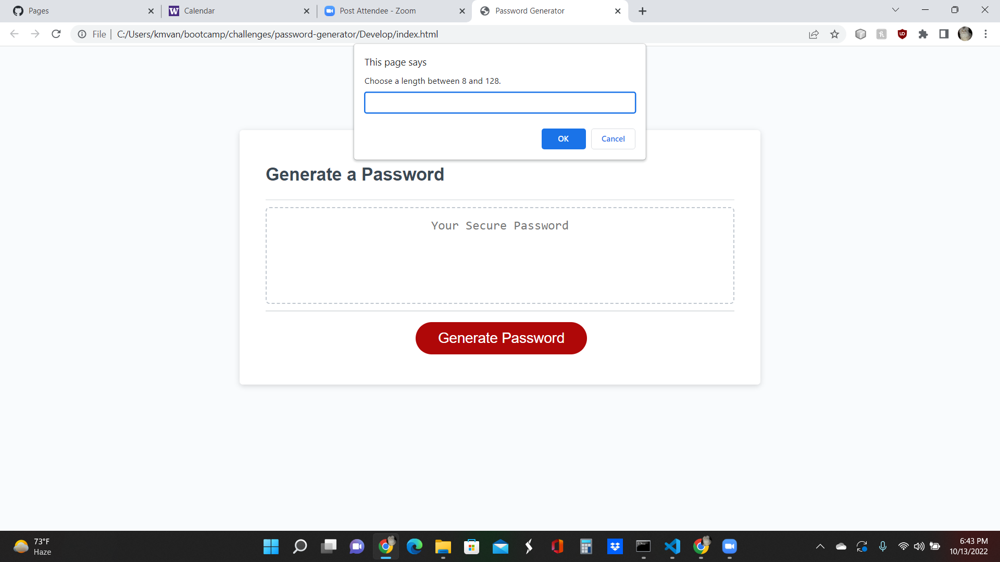

# password-generator
---

## Description

This program is a password generator that can create random passwords

- Used a while loop to validate if the length of the password was a valid number between 8-128
- Used another while loop to validate that at least one character type was chosen for the password
- Used an array to hold the character type choices in boolean and checked to see if at least one was true to validate
- Concatinated an array of characters based on selection to include and used a randon number genarator to pic from the array
- Commented my code in Javascript
- Created a read.me

## Screenshot

.png)
.png)
.png)

## Link to Project

[https://vanwykkim.github.io/password-generator/]

## Credits

I only created the generate password portion of the Javascript. CSS and HTML were provided by UW bootcamp

## License

Please refer to the LICENSE in the repo.
